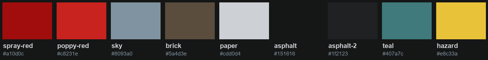

# Dirty Rebirth style guide

> **v0.1.2 · provisional.** Stylised realism in evacuated London, told through street graffiti.



Painted, not photographed. Between realistic and cartoony, like Dirty Bomb. Overcast cool daylight, wet streets, Victorian brick railway arches, layered resistance graffiti (red and black stencils, tags, colourful throw-ups), clean white-and-yellow quarantine barriers, and red poppies growing through the cracks.

Free to use for your own projects (MIT). If you have an AI assistant, point it at this repo: it reads
[`AGENTS.md`](AGENTS.md) and applies the style for you.

## Use it
**Any website:** copy [`tokens/dr.css`](tokens/dr.css) in, then use the variables:
```css
body   { background: var(--dr-asphalt); color: var(--dr-paper); font-family: var(--dr-font-body); }
h1, h2 { font-family: var(--dr-font-display); text-transform: uppercase; }
.cta   { background: var(--dr-spray-red); color: var(--dr-paper); border-radius: var(--dr-radius); }
```
Also here: [SCSS](tokens/dr.scss) · [Tailwind preset](tokens/tailwind.preset.js) · [W3C design tokens JSON](tokens/dr.tokens.json) (Style Dictionary, Figma Tokens Studio).

**Always get the latest:** `https://raw.githubusercontent.com/splashcontroldev/dirty-rebirth-style/main/tokens/dr.css`

## Colours
| Token | Hex | Use |
|---|---|---|
| `--dr-spray-red` | `#a10d0c` | Brand accent. The one call to action per screen. Measured from the graffiti red in the key art. |
| `--dr-poppy-red` | `#c8231e` | Lighter accent for hover/highlight on red elements. |
| `--dr-sky` | `#8093a0` | Cool neutral: secondary text, borders, quiet surfaces. |
| `--dr-brick` | `#5a4d3e` | Warm neutral: panels, cards, dividers. |
| `--dr-paper` | `#cdd0d4` | Primary text on dark; paper/poster surfaces. |
| `--dr-asphalt` | `#151616` | Page background. |
| `--dr-asphalt-2` | `#1f2123` | Raised surface on the page background. |
| `--dr-teal` | `#407a7c` | Rare secondary accent (graffiti throw-ups). Use sparingly. |
| `--dr-hazard` | `#e8c33a` | World colour for quarantine barriers and warnings ONLY - never a button or brand colour. |

## Type
- **Big Shoulders Stencil Display** (display): Headings, labels, buttons. Stencil lettering like the stencils on the wall. [Google Fonts](https://fonts.google.com/specimen/Big+Shoulders+Stencil+Display)
- **Rubik Spray Paint** (spray): Graffiti accents only (a word or two). Never body text. [Google Fonts](https://fonts.google.com/specimen/Rubik+Spray+Paint)
- **Inter** (body): Body text and UI copy. Provisional choice. [Google Fonts](https://fonts.google.com/specimen/Inter)

## Rules
- Buttons stay modest in size; text stays generous (16px body minimum). Short sentences, short paragraphs.
- One red thing per screen: the call to action. Everything else is neutral.
- Textures over flat fills: paper, brick, spray overspray and drips, tape, torn poster edges.
- Every surface has a little life: subtle paper grain, a paint drip, a torn edge. Nothing perfectly flat and nothing perfectly symmetrical.
- Motion feels physical (paper settling, paint spraying), never glowing or bouncy.
- Corners are nearly square (2px). Nothing pill-shaped.

## Avoid
- Neon glows, glassmorphism, soft purple/blue gradients - the generic AI look.
- Sunsets or orange skies, glossy plastic, over-sharpened photo/HDR looks.
- Radiation trefoil symbols and generic military props.
- Hazard yellow as a brand or button colour.

## Changes
See [CHANGELOG.md](CHANGELOG.md). This repo is generated automatically from Dirty Rebirth's own design tokens,
so it updates whenever the game's look changes.

---
*Dirty Bomb is © Splash Damage. This guide covers Dirty Rebirth's own look only and contains no Splash Damage artwork.*
